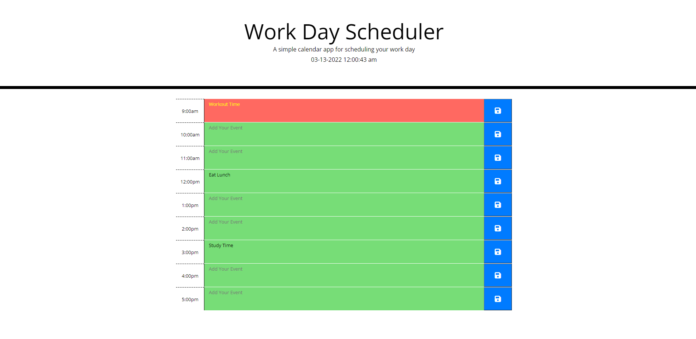

# Work-Day-Scheduler

# Summary
A Work-Day-Scheduler will help you manage your time by toDos

# Purpose
* Will help you add events to the time desired.

* If an event is in the present, the background color of that box will be red.

* If an event is in the future, the background color of that box will be green.

* If an event is in the past, the background color of that box will be gray.
 
 
## Built With
* HTML
* Bootstrap
* JQuery

# App Example 
 
 
# link to the live application

https://jmaouchi.github.io/Work-Day-Scheduler/

## Contribution
Made by [Jugurta Maouchi]  2022.

### ©️2022 Work-Day-Scheduler, Inc 
